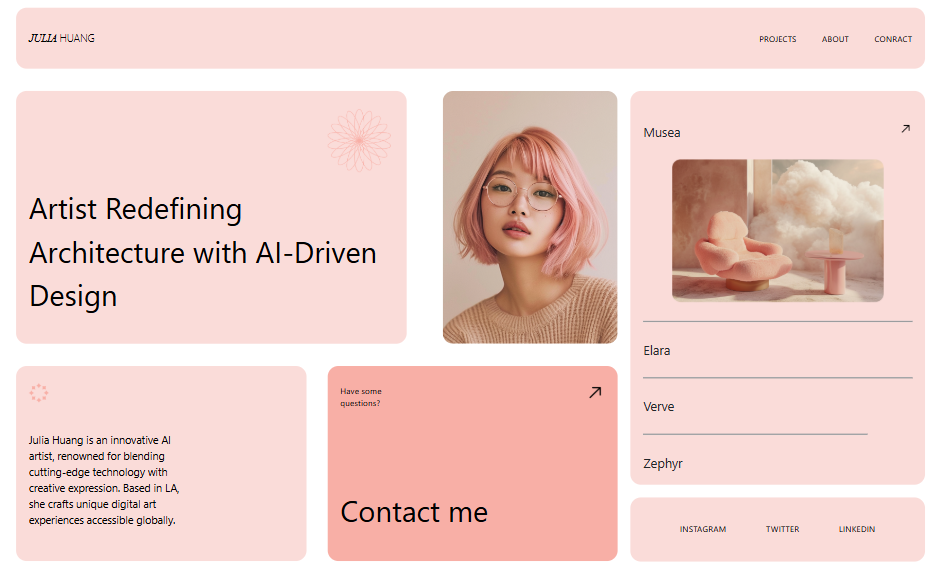

# Julia Huang Portfolio Website

Modern ve duyarlı (responsive) bir portfolio web sitesi. AI sanatçısı Julia Huang'ın çalışmalarını sergileyen, Bootstrap 5 ve özel CSS stillerle tasarlanmış profesyonel bir portfolio sitesi.

## 📸 Önizleme



*Julia Huang Portfolio sitesinin ana sayfası*

## 🎨 Özellikler

- **Responsive Tasarım**: Tüm cihazlarda (desktop, tablet, mobil) mükemmel görünüm
- **Modern UI/UX**: Temiz ve minimalist tasarım yaklaşımı
- **Bootstrap 5**: Güçlü grid sistemi ve bileşenler
- **Custom CSS**: Özel yazılmış stiller ve animasyonlar
- **LESS Desteği**: CSS önişlemci desteği
- **Özel Fontlar**: Gilroy font ailesi kullanımı

## 📁 Proje Yapısı

```
css_deneme/
├── index.html              # Ana HTML dosyası
├── package.json            # NPM bağımlılıkları ve scriptler
├── style.css              # Ana CSS dosyası (root seviye)
└── assets/
    ├── css/
    │   ├── style.css       # Derlenmiş CSS dosyası
    │   ├── style.less      # LESS kaynak dosyası
    │   ├── variables.css   # CSS değişkenleri
    │   └── variables.less  # LESS değişkenleri
    ├── fonts/
    │   └── gilroy/         # Gilroy font dosyaları
    │       ├── Gilroy-Light.ttf
    │       ├── Gilroy-Medium.ttf
    │       ├── Gilroy-Regular.ttf
    │       ├── Gilroy-SemiBold.ttf
    │       └── ... (diğer font varyantları)
    └── images/
        ├── ARROW.png       # Ok ikonu
        ├── IMAGE-2.png     # Portfolio görseli
        ├── IMAGE-3.png     # Form görseli
        ├── Vector.png      # Vektör ikonu
        └── Vector1.png     # Vektör ikonu
```

## 🚀 Kurulum ve Çalıştırma

### Gereksinimler
- Node.js (LESS derlemesi için)
- Modern web tarayıcısı

### Adımlar

1. **Projeyi klonlayın veya indirin**
   ```bash
   git clone [repository-url]
   cd css_deneme
   ```

2. **Bağımlılıkları yükleyin**
   ```bash
   npm install
   ```

3. **CSS'i derleyin (isteğe bağlı)**
   ```bash
   npm run build-css
   ```

4. **Canlı geliştirme için CSS izleme (isteğe bağlı)**
   ```bash
   npm run watch-css
   ```

5. **Siteyi açın**
   - `index.html` dosyasını tarayıcınızda açın
   - Veya canlı sunucu kullanın (Live Server extension vs.)

## 💻 Teknolojiler

- **HTML5**: Semantik markup
- **CSS3**: Modern CSS özellikleri
- **Bootstrap 5.3.7**: Responsive framework
- **LESS**: CSS önişlemci
- **JavaScript**: Bootstrap bileşenleri için
- **Custom Fonts**: Gilroy font ailesi

## 📱 Responsive Breakpoints

- **Desktop**: 1366px ve üzeri
- **Tablet**: 768px - 1365px arası
- **Mobile**: 767px ve altı
- **Custom breakpoint**: 999px (özel responsive davranışlar)

## 🎨 Tasarım Detayları

### Renk Paleti
- **Ana Arka Plan**: #F9F1F0 (Açık pembe/krem)
- **Header Arka Plan**: #FADCD9 (Pembe ton)
- **Metin Rengi**: #000000 (Siyah)

### Tipografi
- **Ana Font**: Gilroy
- **Font Varyantları**: Light, Regular, Medium, SemiBold
- **Font Stilleri**: Normal ve Italic

### Layout
- **Grid Sistemi**: Bootstrap 5 grid
- **Container**: Fluid container kullanımı
- **Padding**: 24px genel padding
- **Border Radius**: 20px yuvarlatılmış köşeler

## 📋 Sayfa Bölümleri

1. **Header**
   - Logo/İsim: "JULIA HUANG"
   - Navigasyon menüsü: Projects, About, Contact

2. **Ana İçerik**
   - **Sol Sütun (8/12)**:
     - Profile kartı (sanat eseri görseli)
     - İletişim kartları (hakkında bilgisi ve iletişim)
   
   - **Sağ Sütun (4/12)**:
     - Proje listesi (Musea, Elara, Verve, Zephyr)
     - Sosyal medya linkleri (Instagram, Twitter, LinkedIn)

## 🔧 Geliştirme

### LESS Kullanımı
Proje LESS önişlemci desteği sunar. Stil değişiklikleri için:

1. `assets/css/style.less` dosyasını düzenleyin
2. `npm run build-css` ile derleyin
3. Veya `npm run watch-css` ile otomatik derleme açın

### CSS Değişkenleri
`assets/css/variables.css` dosyasında özelleştirilebilir değişkenler bulunur.

## 📞 İletişim

Portfolio sahibi: **Julia Huang**
- Konum: Los Angeles (LA)
- Uzmanlık: AI ile sanat ve mimari tasarım

## 📄 Lisans

Bu proje kişisel portfolio amaçlı geliştirilmiştir. Gilroy fontları için `assets/fonts/gilroy/License.txt` dosyasını kontrol edin.

---

*Bu portfolio, AI destekli tasarım ve modern web teknolojilerinin birleşimini gösteren örnek bir projedir.*
